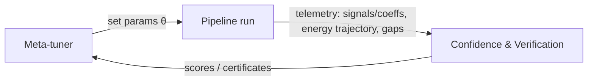

create a virtual environment for this repo
# xxFlow — Repository T ah emplate v0.1

Author: **Rexl1*
Date: **2025-10-10**
Scope: Folder & module structure aligned to the mathematical pipelin of FDA.

---

## Reader’s map (what’s in here)

1. Terminology Translator (Business ↔ Math ↔ Physics) — **quick reference**
2. Why physics here = speed (read this first)
3. Big picture diagrams (pipeline + feedback)
4. Definitions (short, practical)
5. Ordering (Objectives → Lens → Energy)
6. Target layout (reads like the math)
7. Migration map (minimal churn)
8. Confidence & Verification (business framing + artifacts)
9. Parameter search vs Meta-tuner
10. Phased execution plan + success criteria
11. Open questions

---

### S0 — Ingress (Input prep)
- Business: Read normalized signals from real traces
- Math: x ← adapter(data); scaling, alignment
- Physics: Measurement preprocessing
- Notes: Chrome Parquet adapter; deterministic sampling
### S1 — Objectives (Intent)
- Business: Risk, fairness, liveness, coherence (YAML)
- Math: Target functions and constraints
- Physics: Macroscopic goals/constraints
- Notes: Human-readable names; validators
### S2 — Lens (Multiscale representation)
- Business: Make structure visible (coarse vs bursts)
- Math: Wavelet transform; LensContext(bands/scales)
- Physics: Scale-space; local/global separation
- Notes: See wavelets_notes.md; compressed sensing hooks
### S3 — Energy = Logic (Compose energies)
- Business: Encode objectives as energies
- Math: E_total = Σ w_i·E_i(c; θ, LensContext)
- Physics: Potential shaping; convex/quadratic parts
- Notes: HVP hooks exposed for controllers
### S4A — Dynamics: grad/prox (Update state)
- Business: Take steps that reduce energy
- Math: c_{k+1} = Prox(c_k − η∇E_total)
- Physics: Relaxation to equilibrium
- Notes: Step policy, damping, telemetry
### S4B — Dynamics: sparsity prox (Optional)
- Business: Encourage sparse structure
- Math: c ← threshold/prox_sparsity(c)
- Physics: Compressed sensing prior
- Notes: Can also be measured post-run
### S4C — Dynamics: telemetry
- Business: Residuals, energies, steps
- Math: {E_k}, residuals, step sizes
- Physics: Observables over time
- Notes: Used by verification and tuner
### S5 — deFinder (Equilibrium)
- Business: Decide when to stop safely
- Math: Stop when ΔE, Δc, residuals below tol
- Physics: Quasi-static equilibrium
- Notes: Invariants checked here too
### S6 — Controllers (Stability/strategy)
- Business: Adjust dials for stable/fast runs
- Math: Spectral gap via HVP power iteration; schedules
- Physics: Curvature margin; multiscale control
- Notes: Gap coverage drives confidence
### S7 — Confidence & Verification (Acceptance)
- Business: Is the run “good enough”?
- Math: Lyapunov descent, gap coverage, invariants
- Physics: Stability and safety checks
- Notes: Business-facing confidence + technical verification
### S8 — Parameter search (Manual sweeps)
- Business: Prove plumbing and scales before auto
- Math: Grid/random over θ; read verification
- Physics: Design-of-experiments
- Notes: Always run before meta-tuner
### S9 — Meta‑tuner (Automated sweeps)
- Business: Loop to improve settings automatically
- Math: Bayesian/evolutionary; same contracts
- Physics: Feedback controller on θ
- Notes: Feeds back to S3–S4 with new θ

---

# Terminology Translator (Business ↔ Math ↔ Physics)

> Use this to translate names before diving in. One step per stage (S0–S9).

```mermaid
flowchart TD
  root[Terminology Translator]

  %% High-level stages (short labels, ASCII-only)
  root --> S0[Ingress]
  root --> S1[Objectives]
  root --> S2[Lens]
  root --> S3[Energy]
  root --> S4A[Dynamics A]
  root --> S4B[Dynamics B]
  root --> S4C[Telemetry]
  root --> S5[deFinder]
  root --> S6[Controllers]
  root --> S7[Confidence]
  root --> S8[Param search]
  root --> S9[Meta-tuner]

  %% S0 children (concise)
  S0 --> S0B[Business: read signals]
  S0 --> S0M[Math: adapter & scaling]
  S0 --> S0P[Physics: preprocessing]

  %% S1 children
  S1 --> S1B[Business: risk / fairness]
  S1 --> S1M[Math: targets & constraints]
  S1 --> S1P[Physics: macro goals]

  %% S2 children
  S2 --> S2B[Show coarse vs bursts]
  S2 --> S2M[Wavelets / LensContext]
  S2 --> S2P[Scale-space separation]

  %% Keep labels short and ASCII-only to avoid parser issues
```


<details>
  <summary><em>No Mermaid?</em> Quick text fallback</summary>

* **S0 Ingress** — *Business*: read normalized signals; *Math*: (x ←) adapter(data); *Physics*: measurement preprocessing.
* **S1 Objectives** — YAML targets & constraints.
* **S2 Lens** — wavelets / scale-space; LensContext.
* **S3 Energy** — (E_{total}=\sum w_iE_i(c;θ,\text{Lens})); HVP hooks.
* **S4A/B/C Dynamics** — grad/prox, optional sparsity prox, telemetry.
* **S5 deFinder** — stop on ΔE/Δc/residual tolerances; check invariants.
* **S6 Controllers** — spectral gap, multiscale schedules, sparsity control.
* **S7 Confidence & Verification** — Lyapunov descent, coverage, invariants.
* **S8 Parameter search** — manual sweeps first.
* **S9 Meta-tuner** — automated sweeps feeding back to S3–S4.

</details>

---


## Why physics here = speed (read this first)

* **Curvature control (spectral gap)** tames the optimization landscape → larger stable steps, fewer iterations.
* **Multiscale representation (Lens)** separates global trends from bursts → better conditioning, cheaper updates.
* **Sealed control flow (jit + scan) & vectorization (vmap)** exploit hardware → big speedups once dynamics are “tamed.”

> In short: we go faster by shaping energy and controlling dynamics, then letting JAX/XLA run the math tight.

---

## Big picture (diagrams)

### Primary pipeline (MS Flow)

```mermaid
flowchart TD
  S0[Ingress (adapters -> normalized signals)] --> S1[Objectives (YAML configs)] --> S2[Lens (multiscale transform / wavelets)] --> S3[Energy functionals (Energy = Logic)] --> S4[Dynamics loop (grad / prox)] --> S5[deFinder (equilibrium + guards)] --> S6[Controllers (gap, schedules, sparsity)] --> S7[Confidence & Verification] --> S8[Parameter Search (manual)] --> S9[Meta-tuner (automated sweeps)]
```

### Meta-tuner feedback loop



---

## Definitions (short and practical)

* **Objectives** (your `business_problem`): human-meaningful targets (tail-latency risk, fairness variance, liveness, coherence). YAML-configured.
* **Lens**: transform basis that exposes structure for efficient optimization (wavelets, compressed sensing).
* **Energy functionals**: mathematical (E_i(u)) composing the objective in the lens.

  * API: `compile_energy_functional(cfg) -> (energy_fn, grad_fn, hvp_fn, metadata)`
* **Dynamics**: gradient flow / proximal splitting + stepping policies.
* **Finders**: orchestrators that run to equilibrium with stopping rules & invariants; align with FDA.
* **Controllers**: stability & multiscale strategy (spectral gap, schedules, sparsity).
* **Certificates**: evidence the run is correct & stable (Lyapunov descent, gap coverage, invariant preservation, residual bounds).
* **Parameter search**: manual sweeps verify plumbing & scales before the meta-tuner.

Plain-English helpers:

* **HVP (Hessian-Vector Product)**: use autodiff (JVP of grad) to estimate ∇²E·v, enabling cheap power iterations.
* **Spectral gap**: difference between key eigenvalues; positive gap ⇒ local exponential convergence. Track **coverage** (fraction of steps with gap ≥ threshold) as a certificate.

---

## Ordering (where does the lens sit?)

* Select/configure the **Lens before Energy**, because energies operate in a basis that exposes sparsity/locality.
* Some energies live in the primal domain but still consume **LensContext** summaries (coeff histograms, sparsity ratios).

> **Order used throughout:** Objectives → Lens → Energy.

---
## Confidence & Verification (formerly “Certificates”)

**Business framing (confidence)**

* Stable improvement: energy trend smooths & decreases (Lyapunov-style).
* Healthy stability margin: spectral gap **coverage ≥ threshold**.
* No illegal states: invariants/constraints within tolerance.
* Residuals in bounds: objective-specific error targets met.


## Policy 

* Parameter search must pass confidence thresholds **before** enabling the meta-tuner.
* All knobs via YAML; **no hardcoded weights**.

---

## Parameter search vs Meta-tuner

* **Start with parameter search** to validate plumbing, lens, energy composition, and controller wiring (catch shape/dtype/jit bugs early).
* **Meta-tuner** is enabled only after parameter search passes certificates on representative runs. It automates sweeps using the same contracts.

**Policy**

* YAML-only configuration for energies & orchestrators.
* Tests focus on determinism & certificates; experiments gather broader telemetry.

---

## Target layout (reads like the math)


**IO policy**

* Library never writes to repository paths during tests.
* Tests write only to `tmp_path`. Experiments (outside tests) write to `outputs/` and `logs/` (gitignored).

---

## Template Setup
This template preserves repository-level developer configuration so you can start a clean project while reusing CI, editor, and tooling setup.

Quick workflow

1. Copy the template into a new directory and replace placeholders using the included `init_new_repo.ps1` script.
2. Inspect and edit `CODEOWNERS`, `copilot-instructions.md`, and any placeholder values.
3. Initialize git and optionally create a GitHub repo (the script can use the `gh` CLI if available).

Files included

- `.github/workflows/` — CI workflows (parameterized)
- `.gitattributes` — recommended attributes (LFS exceptions)
- `pyproject.toml` — pytest + pylint config (trimmed)
- `requirements.txt` — pinned deps
- `template.code-workspace` — VS Code workspace settings and extensions recommendations
- `copilot-instructions.md` — agent instructions stub (edit for new project)
- `CODEOWNERS` — template owners file (edit to set owners)
- `init_new_repo.ps1` — PowerShell helper to create a new repo from this template

How to use (PowerShell)

Run from this folder or pass the absolute path to the template. The script now supports extra options:

- `-DryRun` — scan files and report which placeholders would be replaced, without copying or writing files.
- `-VenvName <name>` — set the venv folder name used in placeholders (default: `.venv`).
- `-ForceUpdate` — if the destination already has a `.git` repo, update placeholders in-place instead of aborting.

Example (create new repo):

```powershell
.\init_new_repo.ps1 -Destination "C:\dev\my-new-project" -RepoName "my-new-project" -GitHubOwner "my-org" -CreateRemote
```

Example (dry-run):

```powershell
.\init_new_repo.ps1 -Destination "C:\temp\preview" -RepoName "preview" -DryRun -VenvName ".venv"
```

What the script does

- Copies the template into the destination (unless `-DryRun` or updating in-place).
- Replaces tokens such as `REPO_NAME_PLACEHOLDER`, `GITHUB_OWNER_PLACEHOLDER`, `PYTHON_INTERPRETER_PLACEHOLDER`, `ENV_FOLDER_PLACEHOLDER`, and workflow branch/path tokens.
- Initializes a Git repo (unless the destination already had one and you used `-ForceUpdate`).
- Optionally creates a GitHub repo via `gh` when `-CreateRemote` is supplied.

After creating the repo:

- Open the workspace file in VS Code and confirm the interpreter path (the script sets workspace tokens to `${workspaceFolder}\\<VenvName>\\Scripts\\python.exe`).
- Edit `CODEOWNERS` and `copilot-instructions.md` to reflect owners and automation rules for the new repo.
- Run tests and lint locally to confirm environment:

```powershell
python -m venv .venv
.\.venv\Scripts\Activate.ps1
pip install -r requirements.txt
pytest -q
```

Troubleshooting notes

- Ensure `git` is installed and on PATH. The script will stop early if `git` is missing.
- To auto-create a remote repo the script uses the GitHub CLI (`gh`). Install it and ensure you're authenticated (`gh auth login`).
- PowerShell profiles may auto-activate venvs on terminal open. If you rely on deterministic behavior across developers and CI, prefer the standard `.venv` name and avoid machine-specific profile hooks.

Dry-run and CI

The template includes a small integration test `tests/test_init_template.py` that attempts to run the PowerShell init script into a temp dir and then runs `pytest` against the generated skeleton. The test is skipped when PowerShell isn't present on PATH.
